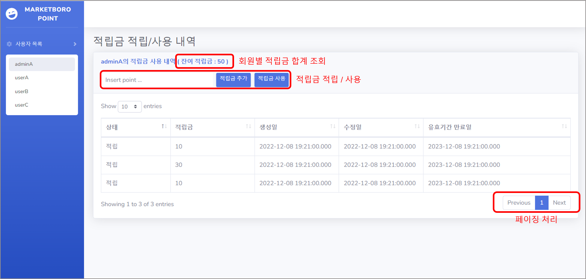
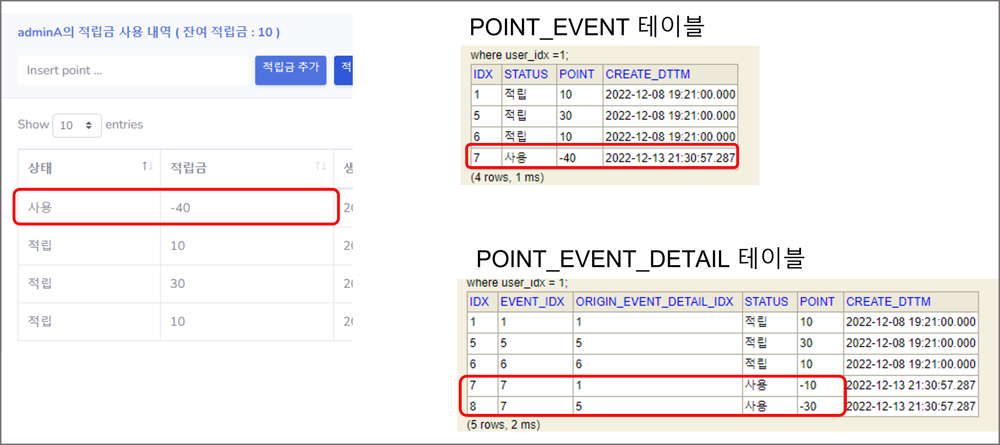

# marketboro_point


### 개요

---

적립금 조회 및 사용 기능을 Spring-boot를 이용하여 구현했습니다.

<br/>
<br/>

### 개발환경

---

- Java (jdk 1.8)
- Spring-boot v2.6.1
- H2 (Mybatis)
- Maven
- Junit
- Jsp, Bootstrap

<br/>
<br/>

### ERD

---


- 아래의 내용을 담은 테이블을 구성했습니다.


- __user_group_info__ : 특정 그룹 별 관리 테이블입니다. ( ex, 일반 사용자와 관리자 등 )
- __user_list__ : 실제 사용자 list입니다.
- __point_summary__ : 사용자 별 적립금 현황 테이블입니다. 적립금 변경 이벤트 이후 point_event_detail 테이블을 기준으로 지속적으로 update하며 관리합니다.
- __point_event__ : 적립금 변경이 발생한 내역을 저장하는 테이블입니다.
- __point_event_detail__ : 선입 선출을 위한 적립금 변경의 세부 내역을 관리합니다.

<br/>
<br/>


### 프로젝트 빌드

---

1. 프로젝트 소스 받기

   ```
   	# 설치하고자 하는 위치에서 실행
   	git clone https://github.com/remme1234/marketboro_point.git
   ```


2. 프로젝트 빌드

   ```
   	# 해당 프로젝트로 이동
   	cd ./marketboro_point/marketboro_point/
   	
   	# 빌드
   	mvn pacakge
   	
   	# 빌드 결과 확인
   	ll ./target/marketboro_point-0.0.1-SNAPSHOT.war
   ```

   

3. 프로젝트 실행

   ```
   	# 프로젝트 실행
   	java -jar ./target/marketboro_point-0.0.1-SNAPSHOT.war
   ```

   ```
   	# web 접속 후 테스트
   	http://localhost:8080/
   ```
   
<br/>
<br/>


### 실행 예제

---

- __web 화면 구성입니다.__
<br/>


<br/>
<br/>

- __적립금 사용 이벤트 발생시, point_event 테이블과 point_event_detail 테이블을 이용하여 선입선출 기능을 구현했습니다.__
<br/>



